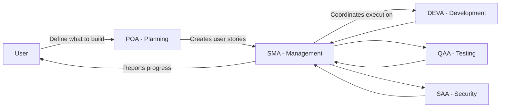

# AgenticScrum Agent Usage Cheatsheet 🚀

## Overview

AgenticScrum is a framework that combines AI agents with Scrum methodology to streamline software development. This cheatsheet provides practical guidance on how to effectively leverage each agent in your development workflow.

### Core Workflow: Plan → Manage → Execute



## 🎯 Agent Quick Reference

| Agent | Primary Role | When to Use | Key Commands |
|-------|--------------|-------------|--------------|
| **POA** | Product Owner | Planning features, creating user stories | "Create user stories for [feature]" |
| **SMA** | Scrum Master | Managing sprints, coordinating agents | "Create sprint with stories from backlog" |
| **DEVA** | Developer | Writing code, implementing features | Managed by SMA |
| **QAA** | Quality Assurance | Testing, code review | Managed by SMA |
| **SAA** | Security Audit | Security review, compliance | Managed by SMA |

## 📋 The AgenticScrum Workflow

### Phase 1: Planning with POA
**Your Role**: Work directly with POA to define what needs to be built

```markdown
User: "POA, I need to add user authentication to my application"

POA Response:
- Creates epic for authentication system
- Breaks down into user stories
- Defines acceptance criteria
- Prioritizes based on dependencies
```

### Phase 2: Sprint Management with SMA
**Your Role**: Work with SMA to manage how features get built

```markdown
User: "SMA, create a sprint with the authentication stories"

SMA Response:
- Creates 2-week sprint
- Assigns stories to appropriate agents
- Sets up tracking and monitoring
- Coordinates agent activities
```

### Phase 3: Execution (Managed by SMA)
**Your Role**: Monitor progress through SMA reports

```markdown
SMA manages:
- DEVA implements the code
- QAA writes and runs tests
- SAA performs security review
- Documentation updates
```

## 🚀 Best Practices

### 1. **Start with Clear Planning**
```markdown
# Good POA Request
"POA, create user stories for a multi-tenant authentication system supporting 
email/password and OAuth2 (Google, GitHub). Include role-based permissions."

# Less Effective
"POA, we need login functionality"
```

### 2. **Let SMA Coordinate Technical Work**
```markdown
# Good SMA Request
"SMA, create a sprint focused on the authentication stories. Prioritize 
core login functionality first, then OAuth2 integration."

# Less Effective
"Hey DEVA, write me a login system"
```

### 3. **Use POA for Requirement Changes**
```markdown
# When requirements change
"POA, we need to add two-factor authentication to our existing auth stories. 
Please update the acceptance criteria."
```

### 4. **Review Progress with SMA**
```markdown
# Regular check-ins
"SMA, provide sprint status update"
"SMA, what impediments are blocking progress?"
"SMA, show documentation status for completed stories"
```

## 💡 Practical Example: Building User Authentication

### Step 1: Initial Planning with POA

```markdown
User: "POA, I need to implement user authentication for a SaaS application. 
Requirements:
- Email/password authentication
- Password reset via email
- Remember me functionality
- Session management
- Basic user profile (name, email, avatar)
"

POA creates:
- Epic: User Authentication System
- Story 1: Basic email/password authentication
- Story 2: Password reset flow
- Story 3: Session management
- Story 4: User profile CRUD
```

### Step 2: Sprint Setup with SMA

```markdown
User: "SMA, create a 2-week sprint with the authentication stories. 
Start with stories 1 and 3 as they're foundational."

SMA response:
"Sprint 1 created with focus on core authentication:
- Assigned Story 1 to DEVA_Python for backend API
- Assigned Story 3 to DEVA_Python for session handling
- QAA will create test plans for both stories
- SAA will review security implementation
- Estimated velocity: 13 story points"
```

### Step 3: Development Coordination (Managed by SMA)

```markdown
SMA coordinates:
Day 1-3: DEVA_Python implements authentication endpoints
Day 4-5: QAA writes integration tests
Day 6: SAA performs security review
Day 7-8: DEVA implements fixes from reviews
Day 9: Final testing and documentation
Day 10: Sprint review and deployment prep
```

### Step 4: Progress Monitoring

```markdown
User: "SMA, provide sprint status"

SMA: "Sprint 1 Status Report
## Progress Summary
- Stories Completed: 1/2
- Story Points Completed: 5/13
- Days Remaining: 5

## Current Status
- **Completed**: Basic authentication API
- **In Progress**: Session management (70% done)
- **Blocked**: None

## Documentation Status
- **Completed**: API endpoint documentation
- **Required**: Session management guide

## Next Steps
- Complete session management implementation
- Full security review scheduled for tomorrow"
```

## 🛠️ Common Commands and Prompts

### POA Commands
```markdown
# Feature Planning
"POA, create an epic for [feature] with user stories"
"POA, break down [story] into smaller tasks"
"POA, prioritize backlog based on [criteria]"

# Requirement Updates
"POA, update acceptance criteria for [story]"
"POA, add dependency between [story A] and [story B]"
```

### SMA Commands
```markdown
# Sprint Management
"SMA, create a [duration] sprint with stories [list]"
"SMA, show current sprint status"
"SMA, identify impediments"

# Agent Coordination
"SMA, assign [story] to appropriate developer agent"
"SMA, ensure all stories have test coverage"
"SMA, verify documentation is complete"
```

## ⚡ Quick Tips

1. **Always start with POA** for new features - proper planning prevents poor performance
2. **Use SMA as your project manager** - don't try to coordinate agents directly
3. **Trust the process** - let each agent focus on their expertise
4. **Review regularly** - use SMA's status reports to stay informed
5. **Document decisions** - POA captures the "why", SMA ensures it's documented

## 🔧 Troubleshooting

### "Which agent should I talk to?"
- **Planning/Requirements**: POA
- **Sprint/Progress/Coordination**: SMA
- **Never directly to**: DEVA, QAA, or SAA (let SMA coordinate)

### "Story is blocked"
```markdown
"SMA, what's blocking [story] and what's the resolution plan?"
```

### "Requirements changed mid-sprint"
```markdown
1. "POA, update [story] with new requirements: [details]"
2. "SMA, assess impact of requirement changes on current sprint"
```

### "Need to add technical debt items"
```markdown
"POA, create technical debt story for [issue]"
"SMA, schedule technical debt items in next sprint"
```

## 📝 Documentation Requirements

SMA ensures all completed stories include:
- Updated README (if applicable)
- API documentation (for new endpoints)
- Code comments for complex logic
- User guides (for user-facing features)
- Architecture decisions (for significant changes)

## 🎯 Success Metrics

Track your AgenticScrum effectiveness:
- **Planning Clarity**: Stories completed without major changes
- **Sprint Velocity**: Consistent story point completion
- **Quality**: Low defect rate post-deployment
- **Documentation**: All stories have required docs

---

**Remember**: AgenticScrum works best when you leverage POA for the "what" and SMA for the "how". This separation of concerns leads to clearer requirements, better coordination, and higher quality deliverables. 🚀