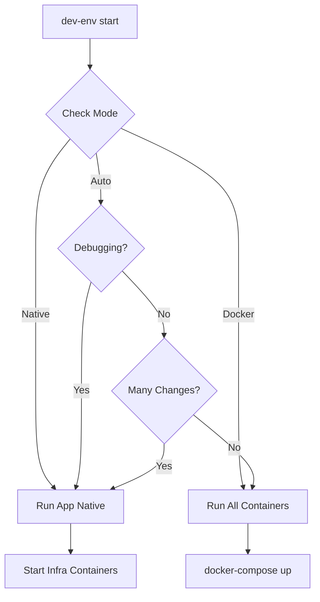

# DevLab - Smart Development Environment Setup

A comprehensive development environment automation toolkit that transforms Ubuntu VMs into powerful dev labs with intelligent container orchestration. Part of the AgenticScrum framework.

## 🚀 Quick Start

```bash
# Clone AgenticScrum
git clone https://github.com/safer-strategy/AgenticScrum.git
cd AgenticScrum/devlab

# Run the setup script
sudo ./devlab-setup.sh

# After setup, use the smart dev environment
dev-env start
```

## 📋 Overview

DevLab provides two main components:

1. **`devlab-setup.sh`** - Complete Ubuntu VM provisioning script
2. **`smart-dev-environment.sh`** - Intelligent development environment manager

These tools solve the common problem of slow Docker-based development cycles while maintaining production parity.

## 🛠️ DevLab Setup Script

### What It Installs

- **Container Stack**: Docker, Docker Compose, Kubernetes (kubectl, minikube, k3s, helm)
- **Languages**: Python 3.x, Node.js 20.x, Go, Rust
- **Dev Tools**: Git, VS Code CLI, GitHub CLI, tmux, vim
- **Monitoring**: Prometheus, Grafana, Netdata
- **Security**: UFW firewall, SSH configuration

### Usage

```bash
sudo ./devlab-setup.sh
```

The script will interactively prompt for:
- Hostname (default: ub00)
- Network configuration (Static IP or DHCP)
- DNS servers
- Component selection

### Example Run

```
$ sudo ./devlab-setup.sh

================================================
   Ubuntu Dev Lab Setup for Casari Project     
   AgenticScrum Framework Deployment            
================================================

=== System Configuration ===
Enter hostname for this VM [ub00]: casari-dev-01
Enter static IP address (or press Enter for DHCP): 192.168.1.100
Enter netmask [255.255.255.0]: 
Enter gateway: 192.168.1.1
Enter primary DNS server [8.8.8.8]: 
Install Docker? [Y/n]: Y
Install Kubernetes (kubectl, minikube, k3s)? [Y/n]: Y
```

## 🧠 Smart Development Environment

The smart dev environment provides intelligent orchestration between native and containerized services.

### Key Commands

```bash
# Start development environment (auto-detects best mode)
dev-env start

# Force native mode (fastest - apps on host, infra in containers)
dev-env start native

# Force docker mode (everything containerized)
dev-env start docker

# Check status
dev-env status

# Switch default mode
dev-mode hybrid  # Smart switching (default)
dev-mode native  # Always use native for apps
dev-mode docker  # Always use containers
```

### How It Works

The system intelligently decides whether to run your application natively or in containers based on:

1. **Current activity** - Debugging? Use native. Integration testing? Use containers.
2. **File changes** - Many changes? Native is faster.
3. **Service dependencies** - Complex deps? Containers ensure consistency.

### Example Workflow

```bash
# 1. Split your docker-compose.yml into app and infrastructure
split-compose

# This creates:
# - docker-compose.infra.yml (databases, redis, etc.)
# - docker-compose.app.yml (your applications)

# 2. Start development
dev-env start

# 3. Monitor performance
dev-perf

# Output:
# Container Resource Usage:
# postgres    0.1%    42.3MiB / 983.2MiB
# redis       0.2%    8.7MiB / 983.2MiB
# 
# Estimated Startup Times:
#   Native Node.js:    ~3 seconds
#   Docker Compose:    ~30-60 seconds
```

## 🏗️ Architecture

### Hybrid Development Model

```
┌─────────────────────────────────────────┐
│          Developer Machine              │
├─────────────────────────────────────────┤
│                                         │
│  Native Processes        Containers     │
│  ┌─────────────┐       ┌─────────────┐ │
│  │  Node.js    │       │  PostgreSQL │ │
│  │  FastAPI    │       │  Redis      │ │
│  │  (Fast)     │       │  ElasticS.  │ │
│  └─────────────┘       └─────────────┘ │
│         │                      │        │
│         └──────────┬───────────┘        │
│                    │                    │
│              Shared Network             │
└─────────────────────────────────────────┘
```

### Decision Flow



## 📊 Performance Comparison

| Scenario | Native Mode | Docker Mode | Improvement |
|----------|------------|-------------|-------------|
| Cold Start | 3s | 45s | 15x faster |
| Hot Reload | <1s | 3-5s | 5x faster |
| RAM Usage | 500MB | 2GB | 75% less |
| CPU Idle | 1% | 5-10% | 80% less |

## 🔧 Configuration

### Project Configuration (`.dev-env.json`)

```json
{
  "project": "casari",
  "defaultMode": "hybrid",
  "services": {
    "always_container": ["postgres", "redis"],
    "prefer_native": ["api", "frontend"],
    "auto_detect": true
  },
  "performance": {
    "lazy_load": true,
    "cache_dependencies": true
  }
}
```

### Environment-Specific Compose Files

```yaml
# docker-compose.infra.yml (always runs in containers)
services:
  postgres:
    image: postgres:15
    environment:
      POSTGRES_DB: casari_dev
    ports:
      - "5432:5432"
  
  redis:
    image: redis:alpine
    ports:
      - "6379:6379"
```

## 🤝 Integration with AgenticScrum

These tools are designed to work seamlessly with the AgenticScrum framework:

1. **Context Awareness** - AM agents can detect development patterns and optimize accordingly
2. **Automated Profiling** - Performance metrics feed back into AM for continuous improvement
3. **Smart Orchestration** - AM can predict which services you'll need based on git branch analysis

### Future AM Integration Points

```python
# Example: AM agent analyzing development patterns
class DevEnvironmentOptimizer:
    def analyze_developer_behavior(self):
        # Track service usage patterns
        # Predict needed services
        # Pre-warm containers
        # Optimize startup sequence
        pass
```

## 🐛 Troubleshooting

### Common Issues

**Issue**: Services not connecting
```bash
# Check if all services are running
dev-env status
# Ensure network connectivity
docker network ls
```

**Issue**: Permission denied errors
```bash
# Fix Docker permissions
sudo usermod -aG docker $USER
# Logout and login again
```

**Issue**: Port conflicts
```bash
# Find what's using a port
sudo lsof -i :5432
# Stop the service or change ports in .env
```

## 📚 Advanced Usage

### Custom Service Detection

Add your own service detection logic:

```bash
# Edit /usr/local/bin/dev-env
# Add to detect_project_type() function
elif [[ -f "Cargo.toml" ]]; then
    echo "rust"
```

### Performance Profiling

```bash
# Compare startup times
dev-env profile native
dev-env profile docker

# Monitor resource usage during development
watch -n 2 'docker stats --no-stream'
```

### CI/CD Integration

```yaml
# .github/workflows/test.yml
- name: Test in production-like environment
  run: |
    dev-mode docker
    dev-env start
    npm test
```

## 🎯 Best Practices

1. **Use native mode during active development** - Faster feedback loops
2. **Switch to docker mode for integration testing** - Ensures production parity
3. **Keep infrastructure always containerized** - Consistency across environments
4. **Profile regularly** - `dev-perf` helps identify bottlenecks
5. **Commit your `.dev-env.json`** - Share optimizations with your team

## 🚢 Migration Guide

### From Traditional Docker Compose

```bash
# 1. Split your existing setup
split-compose docker-compose.yml

# 2. Configure development mode
echo '{"defaultMode": "hybrid"}' > .dev-env.json

# 3. Start using smart commands
dev-env start  # Instead of docker-compose up
```

### From Pure Native Development

```bash
# 1. Containerize your infrastructure
# Create docker-compose.infra.yml with databases, caches, etc.

# 2. Keep application native
dev-mode native

# 3. Enjoy consistent infrastructure
dev-env start
```

## 📈 Metrics & Monitoring

The setup includes built-in monitoring:

- **Grafana**: http://localhost:3000 (visualize metrics)
- **Prometheus**: http://localhost:9090 (metrics storage)
- **Netdata**: http://localhost:19999 (real-time performance)

## 🤖 Contributing

We welcome contributions! Key areas for enhancement:

1. Additional language support (Java, .NET)
2. More intelligent service detection
3. Cloud provider integrations (AWS, GCP)
4. Enhanced AM agent capabilities

## 📄 License

Part of the AgenticScrum framework. See main LICENSE file.

---

*Built with ❤️ for developers who value both speed and reliability*